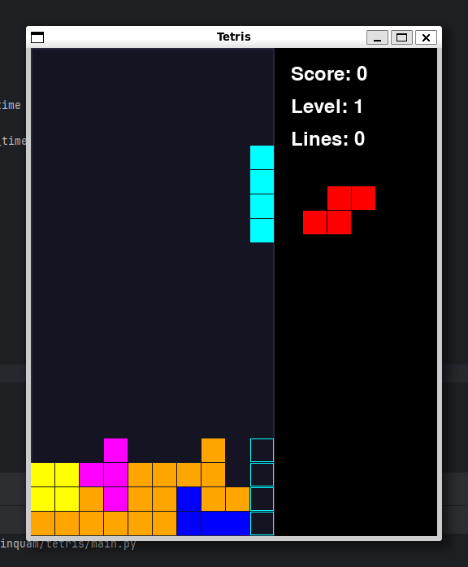

## Simple Tetris Clone using Python and PyGame

### Controls
* **Left/Right** arrows to move
* **Up arrow** to rotate
* **Down arrow** to accelerate drop (hold to continue accelerating)
* **Spacebar** for instant drop

